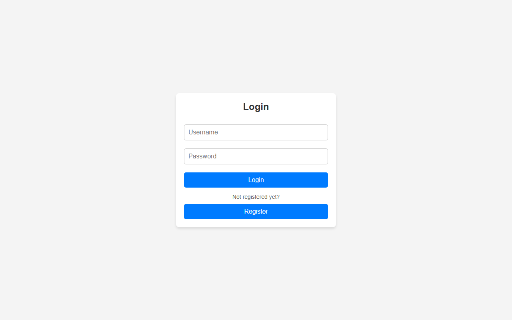
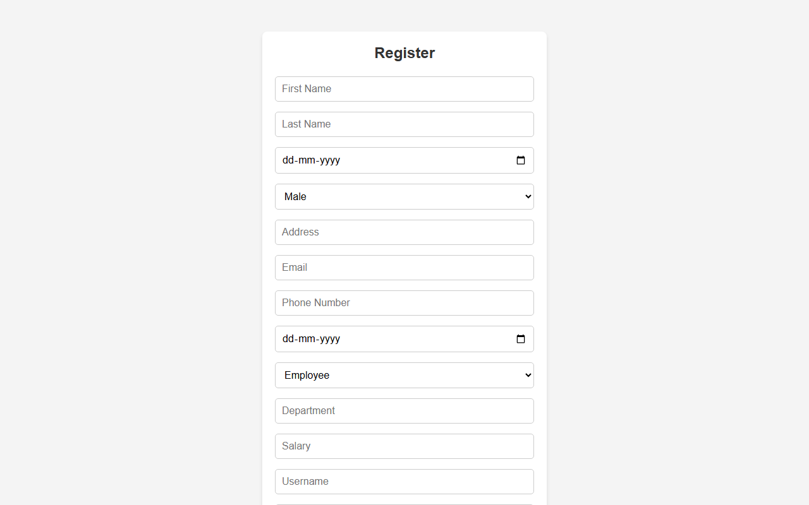

# Employee Management — Full Stack

A full-stack employee management application: a React single-page client backed by a Flask REST API with JWT authentication and role-based access.

## Overview

HR staff and employees sign in through the React client and land on different dashboards depending on their role. HR users can list, add, update and delete employee records; employees can view and update their own record. The backend exposes a JSON API secured with JWT access tokens and persists data through SQLAlchemy.

The project is split into two independent applications — `backend/` (Flask) and `frontend/vite-project/` (React) — that run side by side during development.

## Features

- JWT authentication with login and registration
- Role-based access with separate HR and Employee dashboards
- Employee CRUD API (`GET /api/employees`, `GET|POST|PUT|DELETE /api/employee`)
- Protected client-side routes with automatic logout on token expiry
- Password hashing with bcrypt
- CORS enabled for local development

## Screenshots

**Login**



**Registration**



## Tech Stack

| Layer | Technologies |
| --- | --- |
| Backend | Python, Flask 3, Flask-JWT-Extended, Flask-SQLAlchemy, Flask-Bcrypt, Flask-CORS |
| Frontend | React 19, React Router 7, Vite 6, axios, jwt-decode |
| Database | SQLite by default (via SQLAlchemy) |

## Project Structure

```
employee-management-fullstack/
├── backend/
│   ├── app.py              # Flask app, blueprint registration, entry point
│   ├── config.py           # SECRET_KEY and database URI
│   ├── models.py           # SQLAlchemy models
│   ├── routes.py           # /auth and /api blueprints
│   └── requirements.txt
├── frontend/vite-project/
│   └── src/
│       ├── components/     # Login, Register, HR/Employee dashboards, route guard
│       └── styles/
├── screenshots/
├── requirements.txt
└── .env.example
```

## Installation

**Backend**

```bash
cd backend
python -m venv venv
venv\Scripts\activate          # Windows
pip install -r requirements.txt
```

**Frontend**

```bash
cd frontend/vite-project
npm install
```

## Configuration

Backend settings live in `backend/config.py`:

| Setting | Default | Notes |
| --- | --- | --- |
| `SECRET_KEY` | `your_secret_key_here` | Replace before deploying anywhere |
| `SQLALCHEMY_DATABASE_URI` | `sqlite:///db.sqlite3` | SQLite file created alongside the backend |

A root-level `.env.example` lists `SECRET_KEY` and `DATABASE_URL` as a reference for these values. The backend currently reads them from `config.py`, so edit that file to change them.

## Database Setup

No separate step is required. `app.py` calls `db.create_all()` on startup, which creates the SQLite file and tables if they do not already exist.

## Running the Application

Start the backend first — it listens on port 5000:

```bash
cd backend
python app.py
```

Then start the frontend in a second terminal:

```bash
cd frontend/vite-project
npm run dev
```

Open the URL Vite prints (usually `http://localhost:5173`).

> The React client calls the API at `http://127.0.0.1:5000`, which is written directly into the components. If you change the backend port, update those URLs in `src/components/`.

## Demo Credentials

No credentials are shipped. Use the in-app **Register** screen to create an account, then sign in.

## Notes / Limitations

- Defaults to SQLite. A server database would be needed for concurrent or production use.
- The API base URL is hardcoded in the frontend rather than read from an environment variable.
- Development was AI-assisted: requirements, database schema, UI direction, debugging, testing and integration were done by the author; AI tooling assisted with scaffolding and boilerplate.
- Development dates are approximate. The project was published to GitHub as a single initial commit rather than being developed in public.

## Future Improvements

- Move the frontend API URL into an environment variable.
- Add API tests and a container setup for reproducible deployment.
